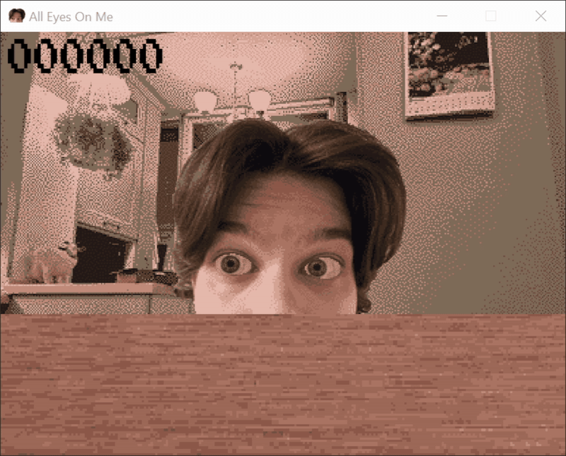

# All Eyes On Me

A small demo showcase about a head that wants to look everywhere with its eyes.
Created in 72 hours for **Siberian Game Jam - November 2025**

## Demo

<p align="center">
  
</p>

## Game Jam Info
- **Event:** Siberian Game Jam - November 2025
- **Theme:** Прозрение (Prozrenie, en Epiphany)
- **Elemnet:** Щ (russian letter "sch")
- **Duration:** 72 hours  
- **Team:** Solo project (code, design, photos, textures by gshigin)  
- **Jam page:** https://itch.io/jam/sibgamejam-nov-2025

## Technical Details

### Installation
```bash
git clone https://github.com/gshigin/oeom-sgj-2025.git
cd oeom-sgj-2025
git submodule update --init --recursive
mkdir build && cd build
cmake ..
cmake --build .
```
### License
This project is licensed under the MIT License. See [LICENSE](LICENSE.md) for details.
This project includes code that depends on SDL, SDL_image, SDL_mixer and SDL_ttf, which is licensed under the Zlib License. See their pages for details.
This project uses "Press Start" font, which is licensed under SIL Open Font License, Version 1.1. see [licence](license) for details